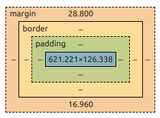

# Box
é calculado com o valor do content.



**Muda o comportamento para calcular a partir da borda**
```css
div {
  box-sizing: border-box;
}
```

# Display

|Propriedade|Block|Inline|
|-|-|-|
|Aranjo elemento|Ocupa toda a linha|elemento ao lado do outro|
|cada elemento| a baixo do outro|ao lado
|width e height|são respeitados|não funcionam|
|padding, margin e border|funcionam normalmente|apenas os valores horizontais|

**Block:** `<p>` `<div>` `<section>` `<h1>`  
**Inline:** `<a>` `<strong>` `<span>` `<em>`

# Margin

Elementos a baixo sofrem margin-colapse (valor das margens se somam)

Elementos ao lado não sobrem margin-colapse

value: Auto (só funciona no width)

# Outline

Borda depois da borda

Mesmo com border-box não é somado o valor ao elemento.

E tambem não impurra os outros elementos da tela.

Usado para acessibilidade, principalmente com :hover.